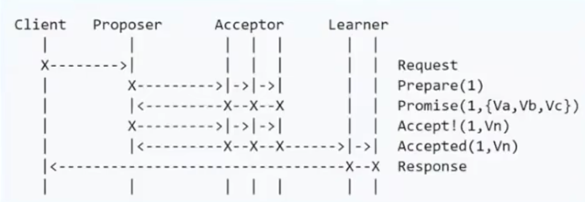
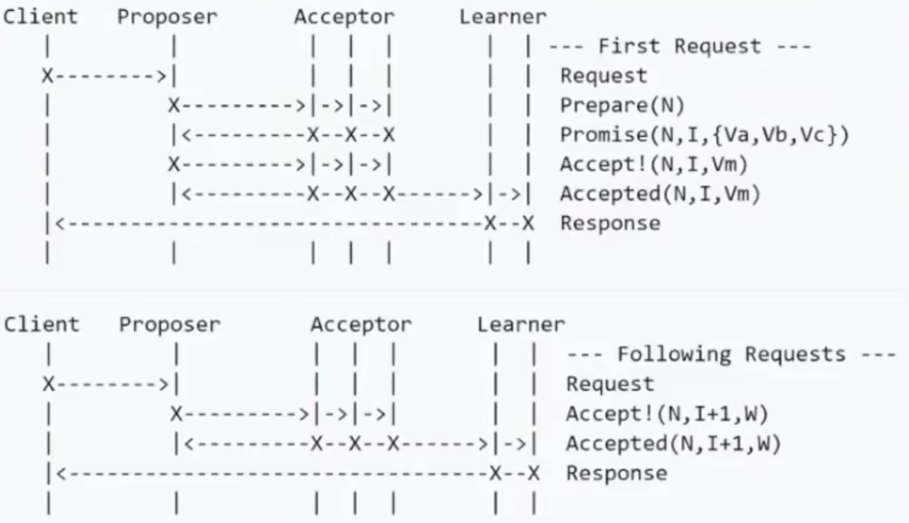

# State Machine Replication

# Paxos

## Basic Paxos

### 概念：

- Client: 提出问题
- Proposer: 具体提案
- Acceptor：提案接受者
- Learner：学习同步Acceptor接受的提案

### 基本流程

1. Phase 1A: Prepare  
   Proposer 提出一个提案，编号为N，N大于之前的题天提案编号。请求Acceptor的Quorum接受
2. Phase 1B: Promise  
   如果N大于Acceptor之前接受的提案编号则接受
3. Phase 2A: Accept  
   如果达到了多数派，Proposer会发出Accept的请求，包括N以及N对应的提案内容
4. Phase 2B: Accepted
   如果acceptor在此期间未收到大于N的提案，则接受N提案内容，否则忽略
   

### 潜在问题

- liveness 活锁问题：多个proposer不断更新提案，使用random间隔时间如raft
- 两轮RPC：Prepare ，Promise 效率问题

## Multi Paxos

### 优化点

- 首先提案确定Leader ，唯一的Proposer,所有请求经过Leader ,后面的每轮请求都不用重选Leader（除特殊情况Leader挂掉）

### 基本流程

#### Raft

子问题分析：

- Leader Election
- Log Replication
- Safety

角色：

- Leader
- Follower
- Candidate

#### ZAB 
- 主要区别在于心跳连接Raft是 leader=>follower , ZAB反之
# Reference

- [raft visualization](https://thesecretlivesofdata.com/raft/)
- [official raft site](https://raft.github.io/)
- [bit tiger 科普 paxos](https://www.bilibili.com/video/BV1TW411M7Fx/?spm_id_from=333.337.search-card.all.click&vd_source=90a71a9c86bdf0b1e0f17380403b7085)